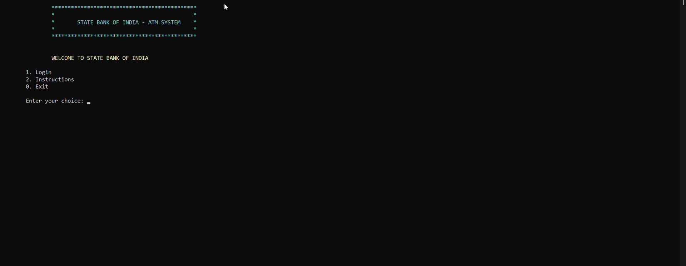
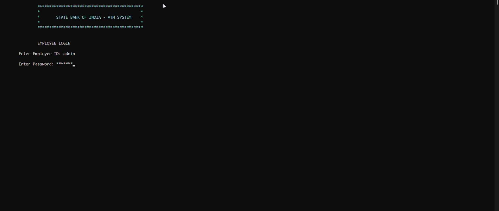
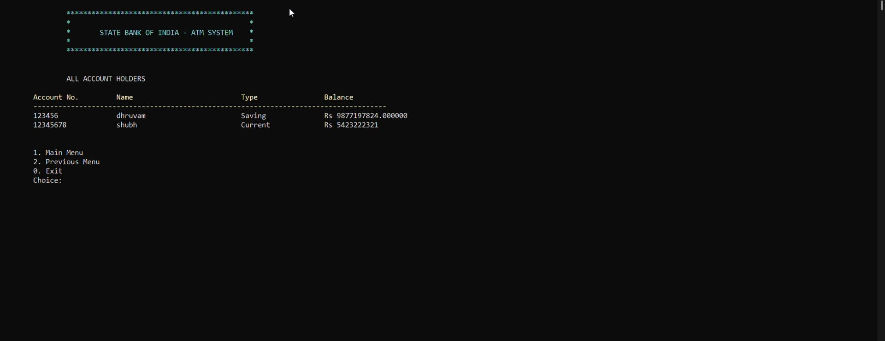

# 💰 Bank Management System (C++)

A CLI-based mini bank application using C++ OOP and basic data structures. It simulates banking operations like account management, transaction handling, and customer service.

---

## 🧑‍💻 Features

- 👤 Create, Search, Modify Bank Accounts  
- 🔐 Login for Customers & Employees  
- 💸 Deposit, Withdraw, Transfer Money  
- 📜 View Transaction History (last 10)  
- 🧾 Customer Support Request Queue  
- 🎨 Colored CLI with clear menus (Windows Only)

---

## 🧠 Tech Stack & Data Structures

- **C++ with OOP (Classes, Objects)**
- **File Handling** with `.csv` files  
- **Data Structures Used**:
  - `BST` → Account Records
  - `map` → Login Credentials
  - `vector`, `stack` → Transactions
  - `queue` → Customer Requests

---

## 📁 Project Structure

```
Bank-Management-System/
├── BankSystem.cpp         → Final implementation
├── New_Bank_Record.cpp    → Legacy code (older version)
├── Bank_Record.csv        → Account database
├── Account_info.csv       → User credentials
├── Employee_info.csv      → Employee credentials
├── BankSystem_1.jpg       → Screenshot 1
├── BankSystem_2.jpg       → Screenshot 2
├── BankSystem_3.jpg       → Screenshot 3
└── README.md              → This file
```

---

## 🖼️ Screenshots

### 🧭 Main Menu


### 🔐 Login Interface


### 📊 Transaction Panel


---

## 🔧 How to Run

1. Clone or Download the repository  
2. Open `BankSystem.cpp` in CodeBlocks / VS Code / DevC++  
3. Compile and Run  
4. Follow on-screen menu

> Note: Windows OS only (uses `conio.h` & `windows.h` for CLI UI)

---

## 🌱 Future Scope

- ✅ Encrypt passwords using hashing
- ✅ GUI frontend (Qt or Web)
- ✅ Replace CSV with SQL database
- ✅ Make cross-platform (Linux/Mac support)

---

## 📜 License

Licensed under the **MIT License** – free to use and modify.

---

> 💬 Created with dedication by **Abhinav Raj**  
 
